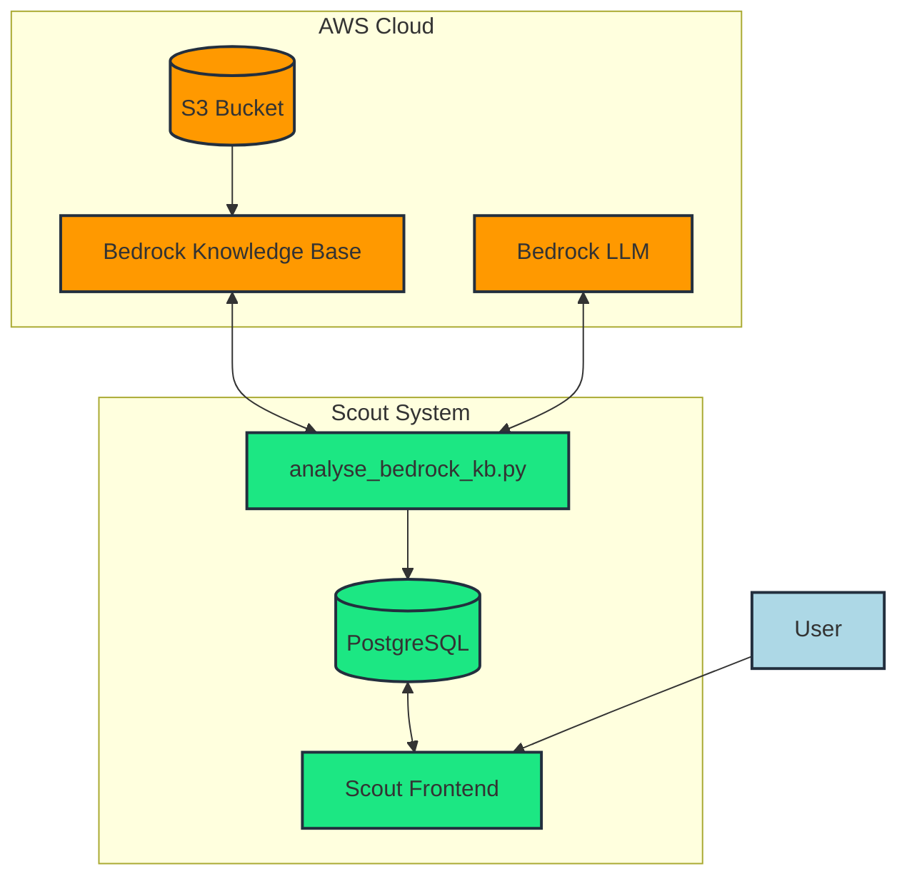
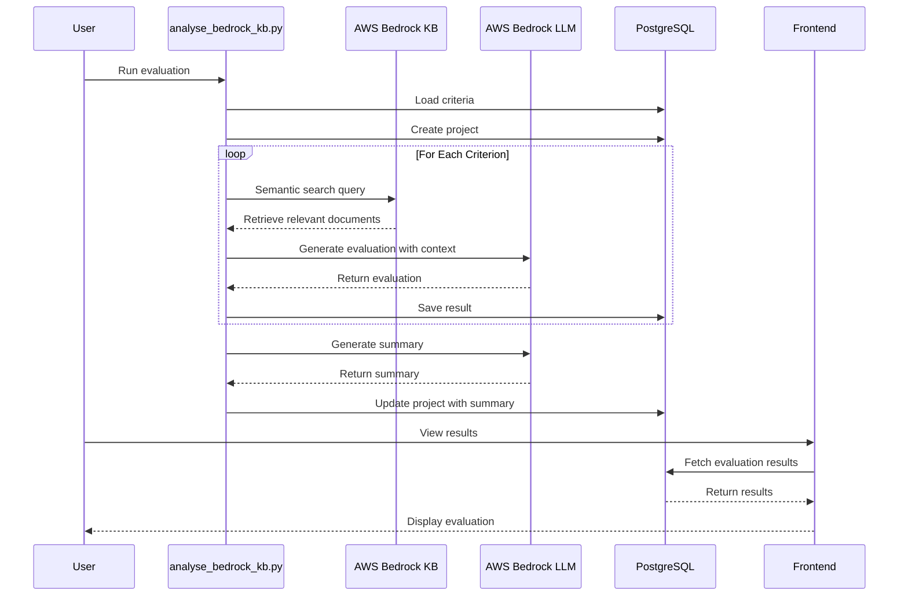
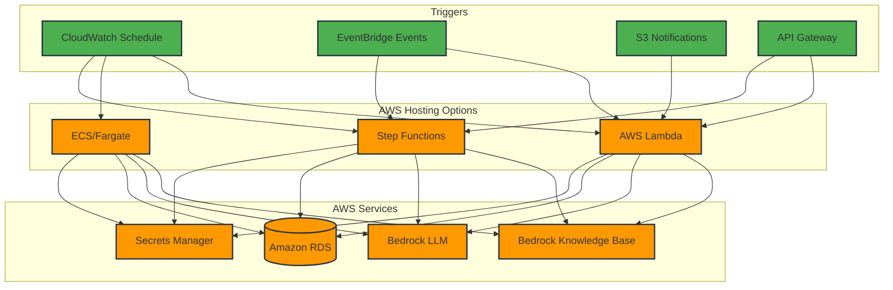
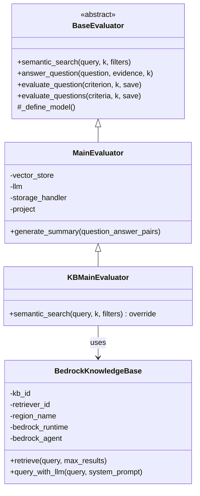
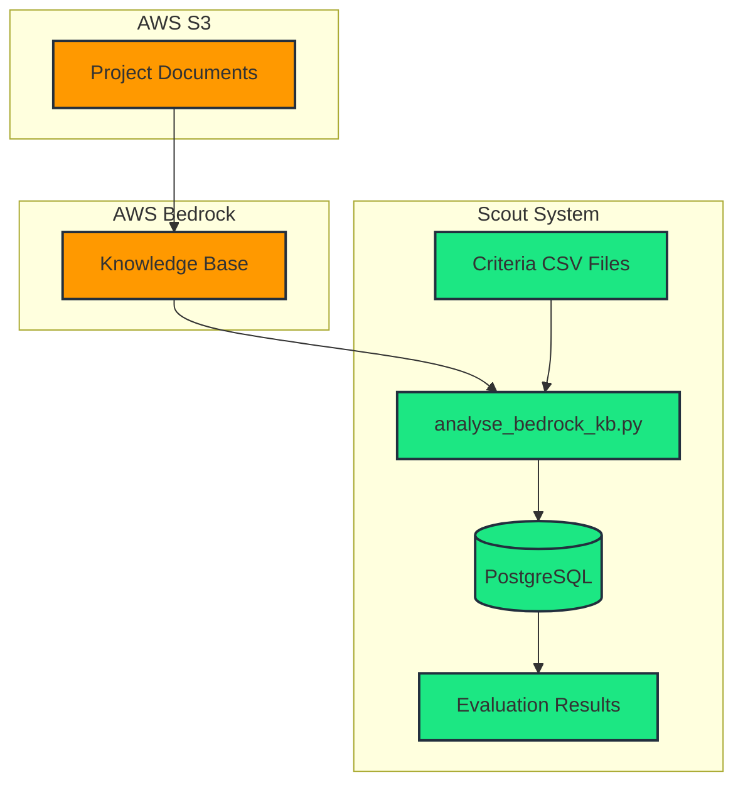

# AWS Bedrock Knowledge Base Integration Flow

This document visualizes how Scout integrates with AWS Bedrock Knowledge Base for document retrieval and evaluation.

## Basic Architecture

## Detailed Evaluation Process

## AWS Hosting Options

## Custom Evaluator Architecture

## Document Flow in Scout with Bedrock KB

